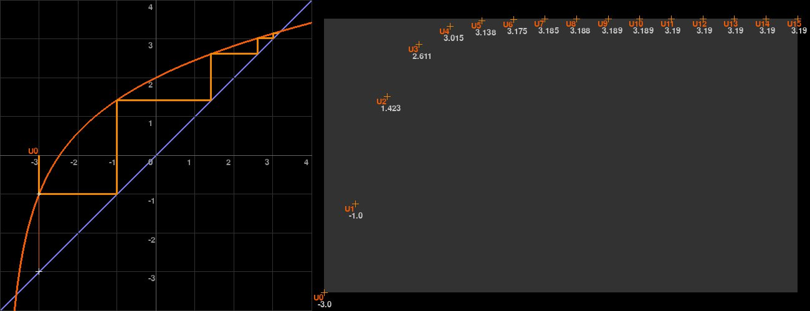
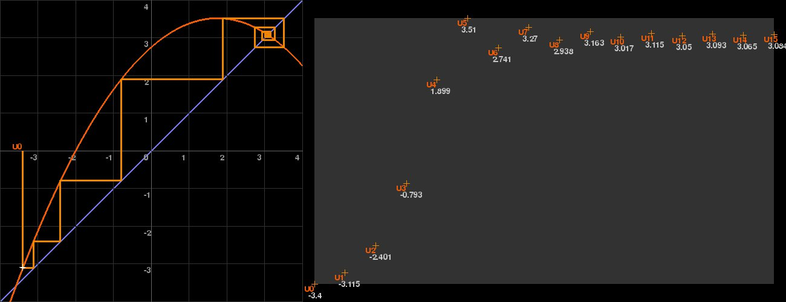

# Suites
## Ex 1 :

$$\forall x \in \left]-4;+\infty\right[ \quad f(x) = \frac{x}{\sqrt{x+4}}+2$$

$$U_0 = -3 \quad \forall n \in \mathbb{N} \quad U_{n+1} = f(U_n)$$

 

## Ex 2 :

$$\forall x \in \left]-\infty;+\infty\right[ \quad f(x) = \frac{1}{8} \left(x+2\right) \left(11-2x\right)$$

$$U_0 = -3,4 \quad \forall n \in \mathbb{N} \quad U_{n+1} = f(U_n)$$

